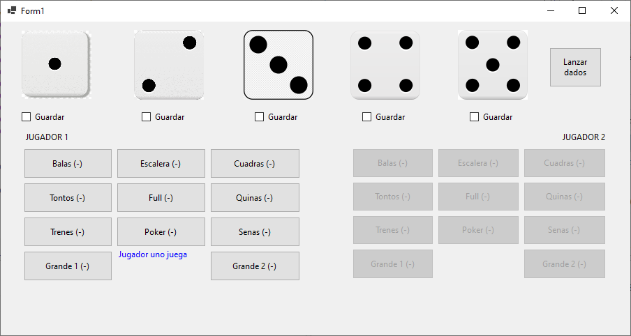

# Evaluacion-Cacho

Implementación del clásico juego de dados **Cacho Alalay**, realizado como la **prueba de evaluación final para la materia de Programación 1**. El sistema se desarrolló en **C#** utilizando **Windows Forms** para la interfaz gráfica.

## Instrucciones de Uso

Para jugar, siga los siguientes pasos:

1.  **Tire sus dados:** Inicie su turno presionando el botón "Lanzar dados".
     * Se calculará automáticamente una bonificación si llega a sacar una jugada especial en el primer tiro.
2.  **Elija dados a conservar:** Seleccione qué dados desea mantener y cuáles prefiere **volver a lanzar** haciendo click en los CheckBox "Guardar" correspondientes.
3.  **Vuelque sus dados (en caso de ser necesario):** Si la mano no es ideal, **voltee sus dados** para ver si las caras opuestas le otorgan mayor puntaje.
    * Puede utilizar el sistema de ayuda para definir su jugada en base al mayor puntaje posible dentro de su turno.
5.  **Registro de puntaje:** Finalmente, se asigna el puntaje en base a los dados tirados.

El segundo jugador debe repetir los mismos pasos para ejecutar su turno. El juego concluye cuando ambos jugadores desarrollan las 11 jugadas disponibles para cada uno.